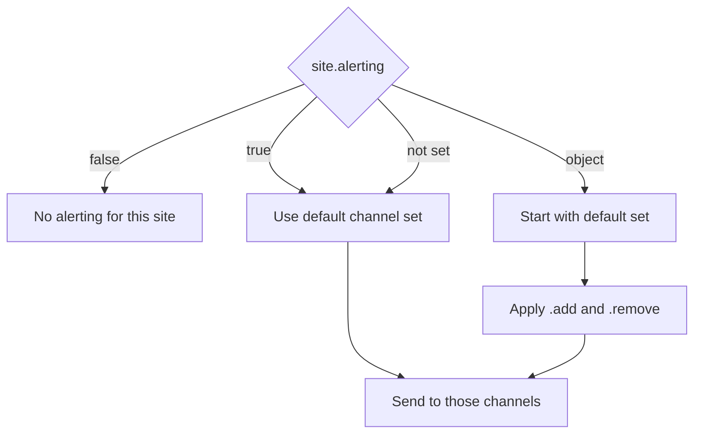

# Alerting Configuration

Alerting is configured in `config.yaml` under the `alerting` key.

::: tip Transition-based
Alerts fire on **state transitions only** — not on every check. A site that stays down does not spam your channel every 10 minutes.
:::

## Channel configuration

Currently supported channel: **Google Chat webhook**.

```yaml
alerting:
  defaults:
    channels:             # optional — if omitted, all defined channels receive all events
      - primary-chat

  channels:
    - type: google-chat
      name: primary-chat
      webhookUrl: https://chat.googleapis.com/v1/spaces/...
      on:
        - site-down
        - site-recovery
        - high-memory
        - memory-recovered
        - high-load
        - load-recovered

    - type: google-chat
      name: critical-only
      webhookUrl: https://chat.googleapis.com/v1/spaces/...
      on:
        - site-down
```

### Channel fields

| Field | Type | Description |
| :--- | :--- | :--- |
| `type` | string | Channel type — currently only `"google-chat"` |
| `name` | string | Identifier used in site-level alerting config |
| `webhookUrl` | string | Google Chat incoming webhook URL |
| `on` | string[] | Which event types this channel receives |

### Event types

`site-down` · `site-recovery` · `high-memory` · `memory-recovered` · `high-load` · `load-recovered`

## Per-site alerting

Each site can override the default channel set:

```yaml
# Use all default channels (or all defined channels if no defaults set)
alerting: true

# Disable alerting for this site entirely
alerting: false

# Add or remove channels from the default set
alerting:
  add:
    - critical-only       # add this channel on top of defaults
  remove:
    - primary-chat        # exclude this channel for this site
```

### Effective channel resolution



The **default channel set** is `alerting.defaults.channels` if defined, otherwise all channels defined under `alerting.channels`.

## Disabling alerting globally

Remove the `alerting` section from `config.yaml` entirely, or set it to an empty object:

```yaml
alerting: {}
```

::: warning
Delivery failures (e.g. invalid webhook URL, network error) are logged but do not throw or crash the runner.
:::
