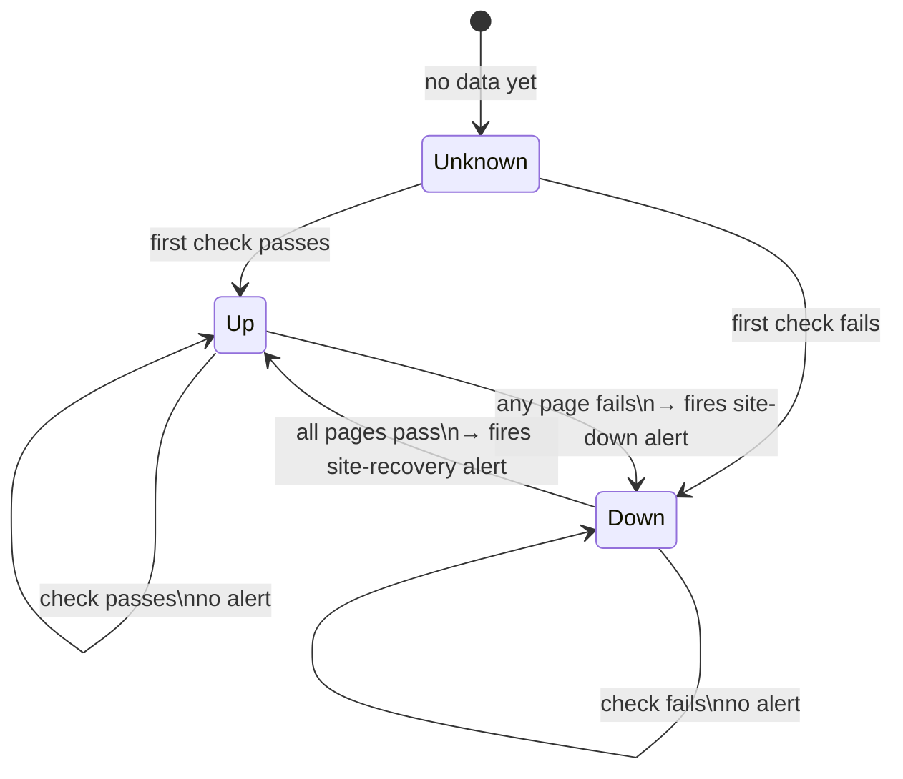
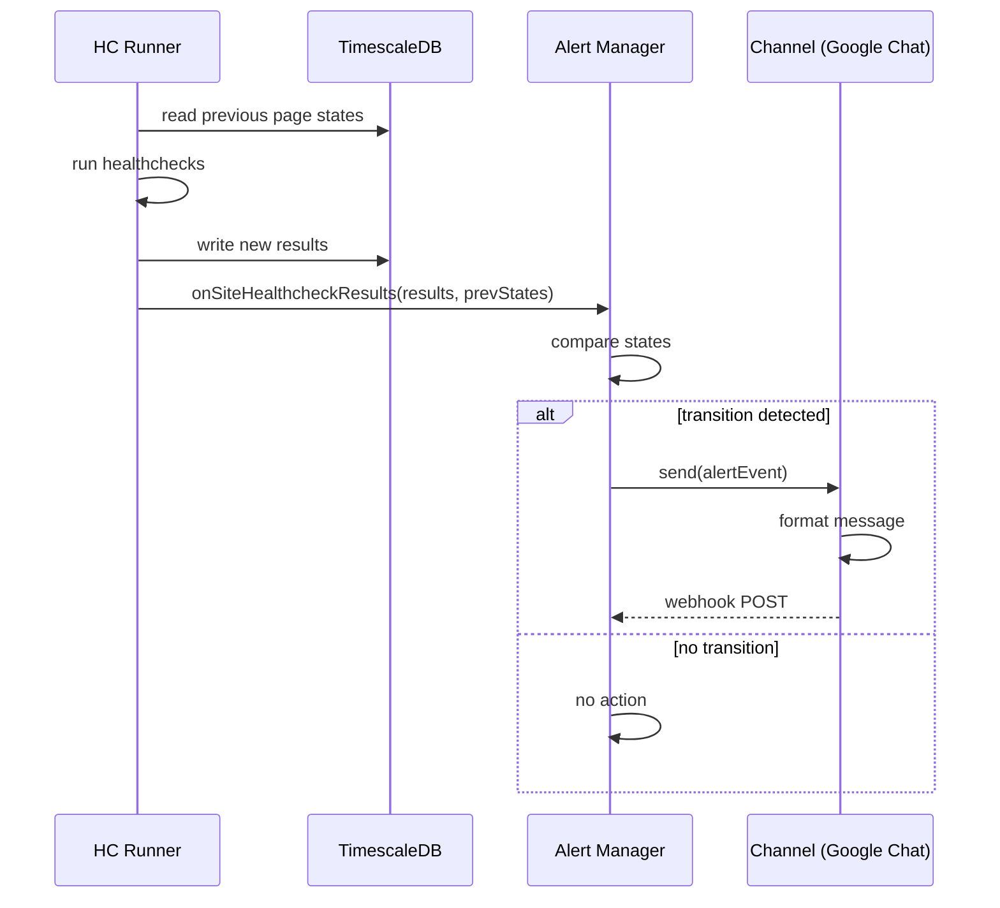

# How Alerting Works

HCW uses a **state machine model** — alerts fire on transitions, not on every check. A site that has been down for an hour does not send an alert every 10 minutes.

## Site alert states



The state is determined by comparing the **current check results** for all pages in a site against the **previous state** stored in the database. An alert fires only when the state changes.

::: info
A site is considered **down** if any of its monitored pages fail. It is considered **up** only when all pages pass.
:::

## Resource alert states

Resource alerts (memory, CPU load) use a hysteresis model to prevent flapping:

| Resource | Alert fires when | Alert clears when |
| :--- | :--- | :--- |
| Memory | Used ≥ **85%** | Used < **70%** |
| CPU load | 1-min avg ≥ **90%** of CPU count | 1-min avg < **60%** of CPU count |

## Alert event types

| Event | Trigger |
| :--- | :--- |
| `site-down` | Site transitions from all-up to any-down |
| `site-recovery` | Site transitions from any-down to all-up |
| `high-memory` | Memory crosses the 85% threshold |
| `memory-recovered` | Memory drops back below 70% |
| `high-load` | CPU load crosses the 90% threshold |
| `load-recovered` | CPU load drops back below 60% |

## Site-down alert payload

When a `site-down` alert fires, the notification includes details about every failing page:

```
Site: my-site (https://example.com)
Pages down: 2/5

• /about
  HTTP 200 · 1.2s · 1/3 selectors failed
  Failed selector: .team-section
  
• /contact
  Navigation error: net::ERR_CONNECTION_REFUSED
```

## Data flow


