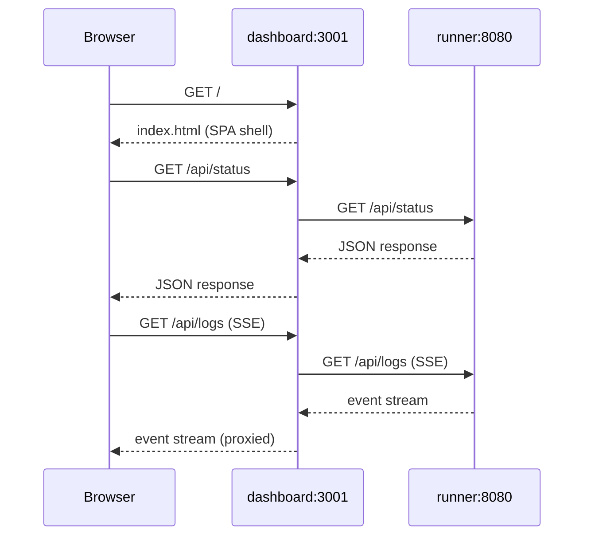

# Dashboard

The dashboard container runs a lightweight Node.js server (`src/dashboard/server.ts`) that does two things:

1. **API proxy** — forwards all `/api/*` requests to the runner at `RUNNER_API_URL`
2. **Static SPA** — serves the pre-built React app for all other routes

## Why a separate container?

Running the dashboard as a separate container lets you restart it independently of the runner — for example, to deploy a UI update — without interrupting any in-flight healthchecks.

## Request flow

All proxying is transparent — the dashboard passes headers and bodies through unchanged. SSE streams are piped directly to prevent buffering.

## Environment variables

| Variable | Default | Description |
| :--- | :--- | :--- |
| `RUNNER_API_URL` | `http://localhost:8080` | Where to proxy `/api/*` requests |
| `DASHBOARD_PORT` | `3001` | Port to listen on |
| `STATIC_DIR` | `src/dashboard/ui/dist` | Path to the pre-built SPA assets |

::: tip Cloud deployments
For deployments where the runner and dashboard are on separate hosts, set `RUNNER_API_URL` to the runner's internal address or load balancer URL.
:::

## Static assets

The React SPA is built by Vite during the Docker image build (`npm run build:ui`) and embedded in the image. No CDN or external file server is needed.
