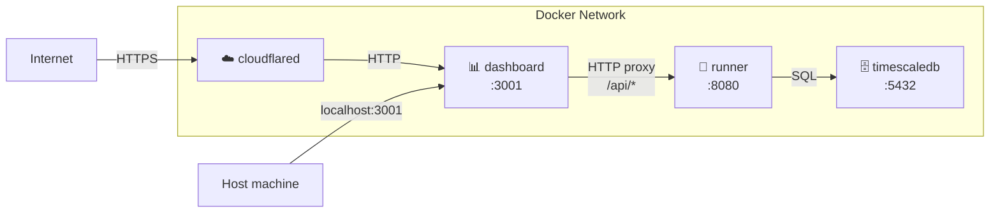

# Architecture Overview

HCW is composed of four Docker containers that communicate over a shared private network.

## Container map

## Containers

| Container | Image | Role |
| :--- | :--- | :--- |
| `runner` | `healthcheck-wrangler` | Scheduler, worker pool, API server |
| `timescaledb` | `timescale/timescaledb` | Time-series database |
| `dashboard` | `healthcheck-wrangler` | React SPA + API proxy |
| `cloudflared` | `cloudflare/cloudflared` | External HTTPS tunnel (optional) |

## Docker networking

Docker Compose automatically creates a shared private network for all services. Each container is reachable by its **service name** as a hostname — no `ports:` mapping is needed for container-to-container traffic.

- The runner connects to TimescaleDB at `timescaledb:5432`
- The dashboard proxies API calls to the runner at `http://runner:8080`
- Cloudflared reaches the dashboard at `http://dashboard:3001`

`ports: "3001:3001"` on the dashboard only exists to expose it to the host machine. It is not required for cloudflared or inter-container communication.

## Detailed docs

- [Runner](/architecture/runner) — scheduler, worker pools, jitter, healthcheck & Lighthouse flows
- [Dashboard](/architecture/dashboard) — API proxy, SPA server
- [TimescaleDB](/architecture/timescaledb) — hypertables, retention policies
- [Cloudflare Tunnel](/architecture/tunnel) — external access without port forwarding
