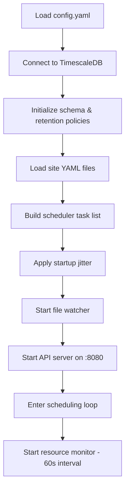
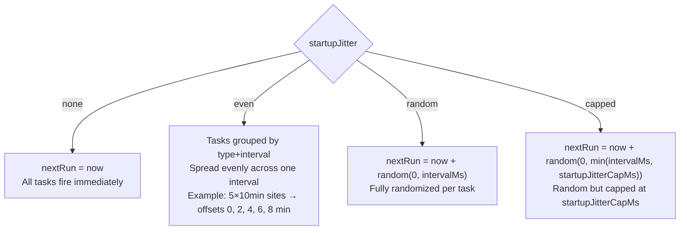
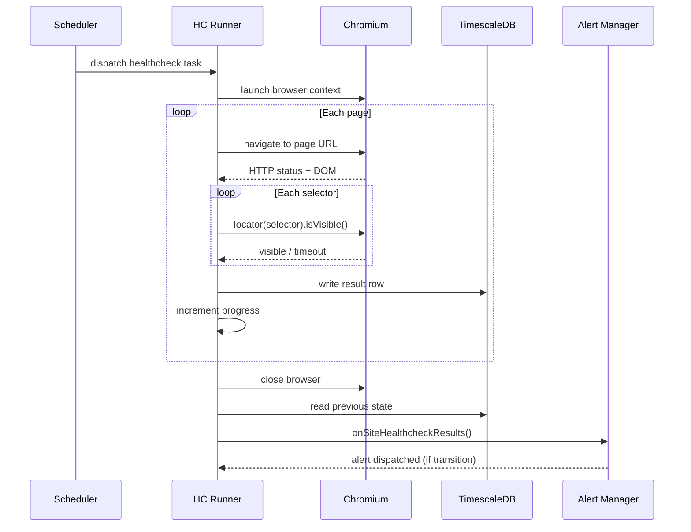
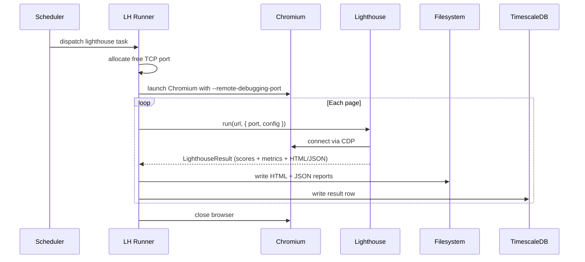

# Runner

The runner is the core process (`src/index.ts`). It owns the scheduler, worker pools, check execution, alerting, and the HTTP API.

## Startup sequence



## Scheduler

The scheduler maintains a flat list of `ScheduledTask` objects — one per site × check type (healthcheck or lighthouse).

```
{ type, site, intervalMs, nextRun, triggeredAt? }
```

**Main loop** (every `schedulerTickMs`, default 1s):

1. Collect all tasks where `nextRun ≤ now`
2. For each due task (in order):
   - Skip if already running
   - Skip lighthouse tasks if `lighthouseInFlightCount ≥ lighthouseWorkers`
   - Break (don't continue) if `inFlightCount ≥ workers`
   - Launch the task, mark it running
3. Update `queueDepth` = due tasks that couldn't be dispatched

When a task completes, `nextRun` is advanced to `now + intervalMs`. The scheduler tracks the last 200 completion durations in a circular buffer to estimate average task duration for the capacity forecast.

### Hot reload

When a site YAML changes, the task list is rebuilt. Existing tasks **preserve their `nextRun` time** — a reload does not reset the schedule. Startup jitter is applied only to genuinely new tasks.

### Manual trigger

`POST /api/sites/:name/trigger/:type` sets `nextRun = now` so the task is dispatched on the next tick. The `triggeredAt` timestamp is tracked separately so the UI can show "running (triggered)" state.

---

## Startup jitter

When the runner starts fresh, all tasks would otherwise fire simultaneously — a thundering herd that floods the worker pool and database. Startup jitter spreads the initial `nextRun` times across the first interval.



::: tip Default: `even`
The `even` mode gives the smoothest spread and is the default. Lighthouse and healthcheck tasks are grouped and jittered independently, so a slow Lighthouse audit won't delay healthchecks.
:::

::: info Lighthouse start delay
Lighthouse tasks always receive an additional `lighthouseStartDelayMs` offset (default 30s) on top of the jitter. This gives the runner time to stabilize before launching heavy browser audits.
:::

---

## Worker pools

HCW maintains two separate worker pools to prevent Lighthouse audits (which are slow and memory-intensive) from blocking healthchecks:

| Pool | Config key | Default | Purpose |
| :--- | :--- | :--- | :--- |
| Healthcheck pool | `runner.workers` | `3` | Playwright-based page checks |
| Lighthouse pool | `runner.lighthouseWorkers` | `1` | Full Lighthouse audits |

Lighthouse tasks are counted against both pools. A Lighthouse task occupies one slot in the healthcheck pool and one in the Lighthouse pool.

---

## Healthcheck execution



**Result determination:** A page is `up` when all selectors are visible **and** HTTP status is in the 2xx–3xx range. Any selector timeout, invisible element, or HTTP error sets `up = false`.

**Browser user-agent:** `Mozilla/5.0 (compatible; {project.name}/0.1; +https://github.com/healthcheckwrangler/healthcheck-wrangler)`

---

## Lighthouse execution

Lighthouse requires a Chrome instance reachable over the Chrome DevTools Protocol (CDP). HCW allocates a free port at runtime and launches Chromium with `--remote-debugging-port` set to that port.



**Why `throttlingMethod: provided`?** Using real network conditions instead of Lantern simulation avoids false NO_LCP errors on JavaScript-heavy sites (e.g. WordPress) where Lighthouse's simulated load model fails to account for JS-rendered content.

**Scores:** raw values (0–1) are multiplied by 100 and rounded. A score of `-1` means the metric was unmeasurable (e.g. NO_LCP on a fully JS-rendered page) — the dashboard distinguishes this from a genuine 0.

**Report paths:** `{reportsDir}/{site}/{page}/{ISO-timestamp}.html` and `.json`

---

## Resource monitoring

Every 60 seconds the runner samples:

- Total memory and free memory (via `os.totalmem()` / `os.freemem()`)
- 1-minute load average (via `os.loadavg()`)
- CPU count

These feed two systems:

1. **Alerting** — resource threshold alerts fire if memory ≥ 85% or load/CPU ≥ 90%
2. **Worker stats** — if `workerMonitoring: true`, a row is written to `worker_stats` with active worker counts, queue depth, and utilization %

---

## Pause & Resume

The runner can be paused via `POST /api/runner/pause`. While paused:

- The scheduling loop skips task dispatch
- In-flight tasks complete normally
- The dashboard shows a prominent paused banner

`POST /api/runner/resume` restores normal operation. **Pause state is not persisted** — the runner always starts unpaused after a container restart.
