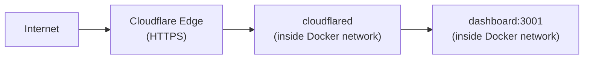

# Cloudflare Tunnel

The `cloudflared` container creates an outbound tunnel from the dashboard to Cloudflare's network, giving you a public HTTPS URL without opening firewall ports or configuring DNS manually.

## How it works



`cloudflared` connects to the dashboard using its service name over the internal Docker network — no `ports:` mapping on the dashboard is required for this to work.

## Configuration

Set `CLOUDFLARE_TUNNEL_TOKEN` in your environment. The token is generated in the Cloudflare Zero Trust dashboard when you create a tunnel.

```yaml
cloudflared:
  image: cloudflare/cloudflared:latest
  restart: unless-stopped
  command: tunnel --no-autoupdate run
  environment:
    TUNNEL_TOKEN: ${CLOUDFLARE_TUNNEL_TOKEN}
  depends_on:
    - dashboard
```

## Port exposure vs tunnel

Both paths reach the same dashboard container:

| Path | How | Requires `ports:` mapping |
| :--- | :--- | :---: |
| Direct host access | `host:3001` → container | ✅ Yes |
| Cloudflare tunnel | Internet → Cloudflare → container | ❌ No |

`ports: "3001:3001"` on the dashboard service is only needed if you want to access the dashboard directly from the host machine. Remove it if you only need tunnel access.

::: tip Optional
The Cloudflare tunnel is entirely optional. HCW works without it — you can access the dashboard directly from the host running the containers, or set up your own reverse proxy (nginx, Caddy, Traefik).
:::
