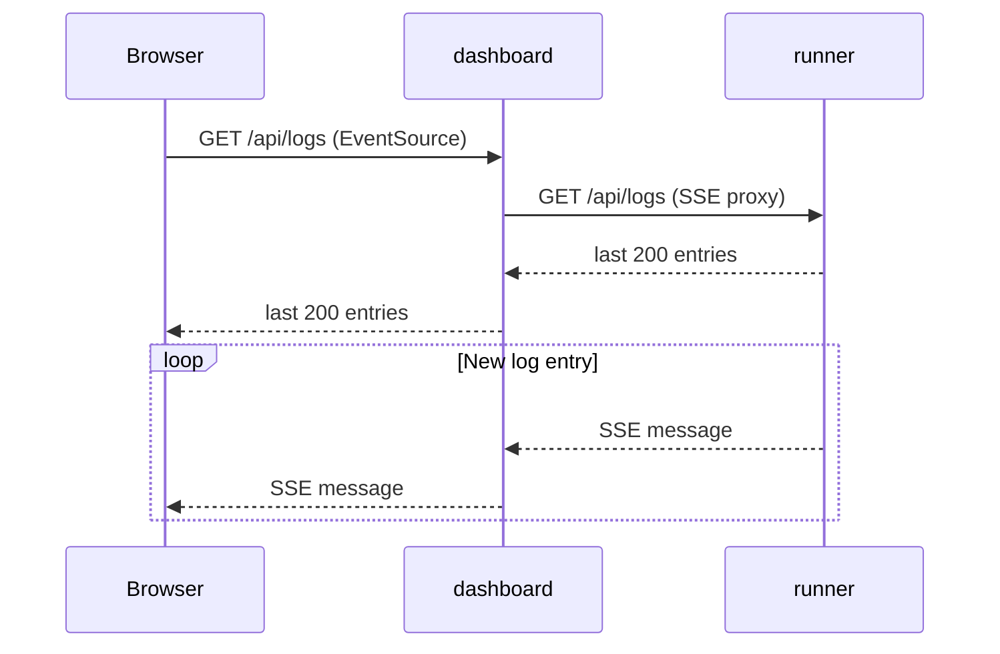

# Logs

The Logs page provides access to structured log entries from the runner. It operates in two modes: **Live** (streaming) and **History** (query).

## Live mode

Live mode opens a Server-Sent Events (SSE) connection to `GET /api/logs`. The server sends the last 200 log entries immediately on connect, then streams new entries as they are logged.

The client buffers the last **1,000** entries. Filtering (level + text) is applied client-side so the stream stays uninterrupted while you change filters.

## History mode

History mode queries `GET /api/logs/query` with time range, level, site, and full-text search parameters. Results are fetched in pages of 100 with a "Load more" button.

Full-text search uses PostgreSQL's `to_tsvector` index on the `msg` column — it searches across log message text efficiently even across large log tables.

## Filtering

| Filter | Live | History |
| :--- | :---: | :---: |
| Level (trace/debug/info/warn/error/fatal) | Client-side | Client-side |
| Text search | Client-side | Server-side (full-text) |
| Site filter | — | Server-side |
| Time range | — | Server-side |

## Log entry structure

Each log entry shows:
- **Timestamp** — ISO format
- **Level badge** — color-coded (red for error/fatal, amber for warn)
- **Site tag** — if the log is associated with a specific site
- **Message**
- **Relative time**

Click any entry to expand it and see the full structured JSON data attached to the log.
