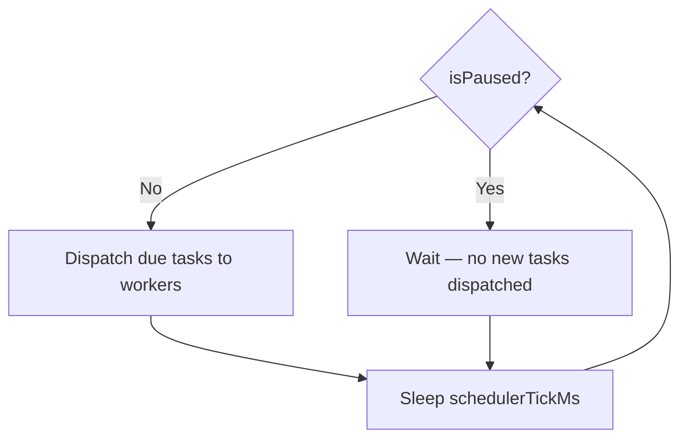

# Pause & Resume

The runner can be paused to temporarily stop dispatching new checks. This is useful before maintenance, restarts, or deployments.

## What pausing does



- **New tasks are held** — the scheduler loop runs but skips dispatch
- **In-flight tasks complete normally** — pausing never interrupts a check already running
- The dashboard shows a **yellow animated banner**: "MONITORING PAUSED — No new checks will start until you resume"

## How to pause

**Via the dashboard:** click the pause button (⏸) in the top bar. A confirmation dialog prevents accidental pauses.

**Via the API:**

```bash
# Pause
curl -X POST http://<host>:8080/api/runner/pause

# Resume
curl -X POST http://<host>:8080/api/runner/resume

# Check state
curl http://<host>:8080/api/status | jq '{paused, active: .workers.active}'
```

## Waiting for idle

To safely pause and wait for all in-flight workers to finish before taking action:

```bash
curl -X POST http://<host>:8080/api/runner/pause

until [ "$(curl -s http://<host>:8080/api/status | jq '.workers.active')" = "0" ]; do
  sleep 3
done

echo "All workers idle — safe to proceed"
```

## Not persisted

::: warning
Pause state is **not persisted**. If the runner container restarts for any reason, it comes back up in the **unpaused** state. If you need to prevent checks from running after a restart, disable the sites in their YAML files or set `runner.workers: 0`.
:::
