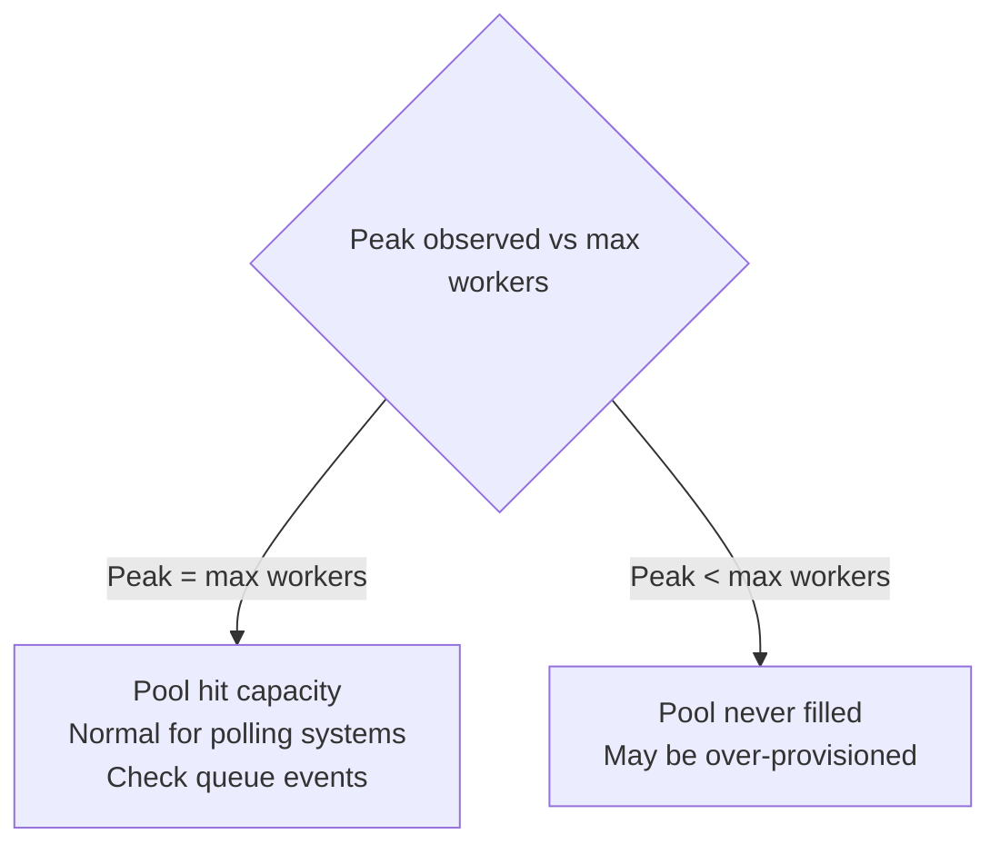
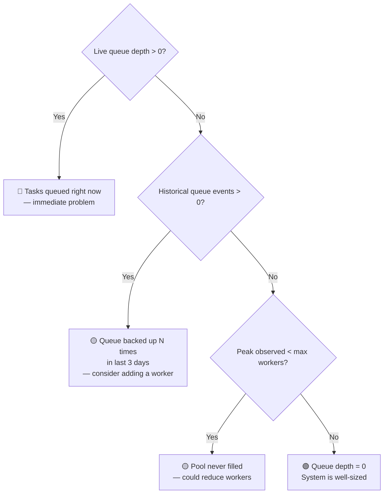

# Capacity Recommendations

The Capacity Forecast table and recommendations panel help you decide whether your current worker count is appropriate.

## Understanding theoretical saturation %

The **Saturation (theoretical)** column uses a steady-state model:

```
satPct = (tasksPerHour × avgDuration) / workers × 100
```

This assumes tasks arrive evenly throughout the hour. **They don't.** Healthchecks arrive in bursts when scheduled intervals expire. A low theoretical satPct is expected and normal for a polling system.

::: warning
Do not use satPct alone as a sizing signal. A system at 15% theoretical saturation can still briefly hit 100% concurrency — that's healthy, not wasteful.
:::

## Peak Observed

The **Peak Observed** stat (shown above the scenario table when enough history exists) reports the highest `active_total` seen in `worker_stats` over the last 3 days.



## Queue Events

**Queue Events** is the count of 1-minute samples where `queue_depth > 0` over the last 3 days. This is the most reliable undersizing signal:

| Queue events | Interpretation |
| :--- | :--- |
| **0** | Workers are keeping up. System is well-sized. |
| **1–5** | Occasional brief queuing. Monitor closely. |
| **>5** | Consistent queuing. Consider adding a worker. |

## Recommendation logic



## When to add a worker

Add a worker when:
- Queue events > 0 and the queue depth chart shows **sustained** queuing (not a brief spike)
- Tasks are running late (next run countdown regularly shows overdue)

Before adding, check the `+1 worker` row in the scenario table — it shows projected RAM. If RAM would exceed 85% of the container limit, increasing the memory allocation may be necessary first.

## When to reduce workers

Reduce workers when:
- Peak observed is consistently **below** `max_workers - 1` over multiple days
- The recommendation panel explicitly suggests it

Each Playwright worker holds a Chromium process in memory even when idle. Reducing from 3 → 2 workers typically frees 100–200 MB of process RSS.

## Adjusting intervals instead

If queue events are occurring but adding workers isn't feasible (memory-constrained), increasing check intervals reduces load without changing `runner.workers`. The recommendation panel suggests a target interval when this applies.
